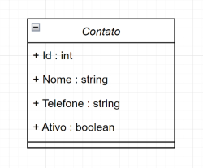
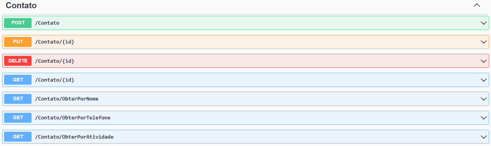

# Sistema gerenciador de Contatos

## Projeto
Projeto desenvolvido para uso de conhecimentos adquiridos sobre API e Entity Framework.

## Contexto
Sistema gerenciador de contatos, onde o usuário poderá cadastrar e manipular uma lista de contatos via API com integração com DB (SQLServer).

Aplicação do tipo Web API com CRUD, permite o usuário obter os registros, criar, salvar e deletar esses registros.

A sua classe principal, a classe contato:



## API

**Swagger**




**Endpoints**

| Verbo  | Endpoint                   | Parâmetro | Body          |
|--------|----------------------------|-----------|---------------|
| POST   | /Contato                   | N/A       | Schema Tarefa |
| PUT    | /Contato/{id}              | id        | Schema Tarefa |
| DELETE | /Contato/{id}              | id        | N/A           |
| GET    | /Contato/{id}              | id        | N/A           |
| GET    | /Contato/ObterPorNome      | nome      | N/A           |
| GET    | /Contato/ObterPorTelefone  | titulo    | N/A           |
| GET    | /Contato/ObterPorAtividade | boolean   | N/A           |

Esse é o schema (model) de Contato, utilizado para passar para os métodos que exigirem:

```json
{
  "nome": "string",
  "telefone": "string",
  "ativo": true
}
```
